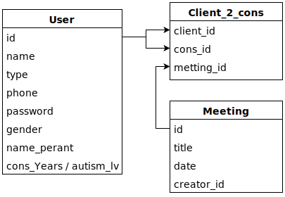

### [Ori Shai & Michal Tmair Project: ScheduleAssist](https://github.com/sholker/exercises_shenkar/tree/main/ScheduleAssist)

#### Improved	communication	with	children	diagnosed	with	autism

##### Characterization
>
> [Characterization](http://shenkar.html5-book.co.il/2020-2021/sr/dev_229/)
> 
>[Architecture](http://shenkar.html5-book.co.il/2020-2021/sr/dev_229/architechture.pdf)
>
> [SRS](http://shenkar.html5-book.co.il/2020-2021/sr/dev_229/srs.pdf)
>
> [Show more](https://app.moqups.com/qnFwytP1S5/view/page/a5993fc26)
 

##### Develop:
>[Website](http://se.shenkar.ac.il/students/2020-2021/web1/dev_222)

- ##### DB Architecture:
> 
> 
> [json_file](json_levels_autism.json)
> 
> 
> [class_diagram](SDD/class_diagram.pdf)
> <object data="SDD/class_diagram.pdf" type="application/pdf" width="700px" height="700px">
    <embed src="SDD/class_diagram.pdf">
        
This browser does not support PDFs. Please download the PDF to view it: <a href="http://yoursite.com/the.pdf">Download PDF</a>.

    </embed>
</object>
